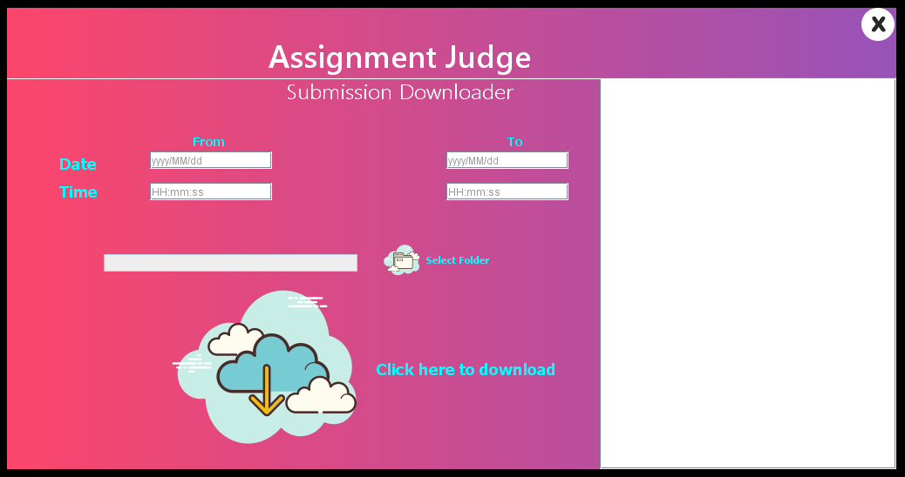
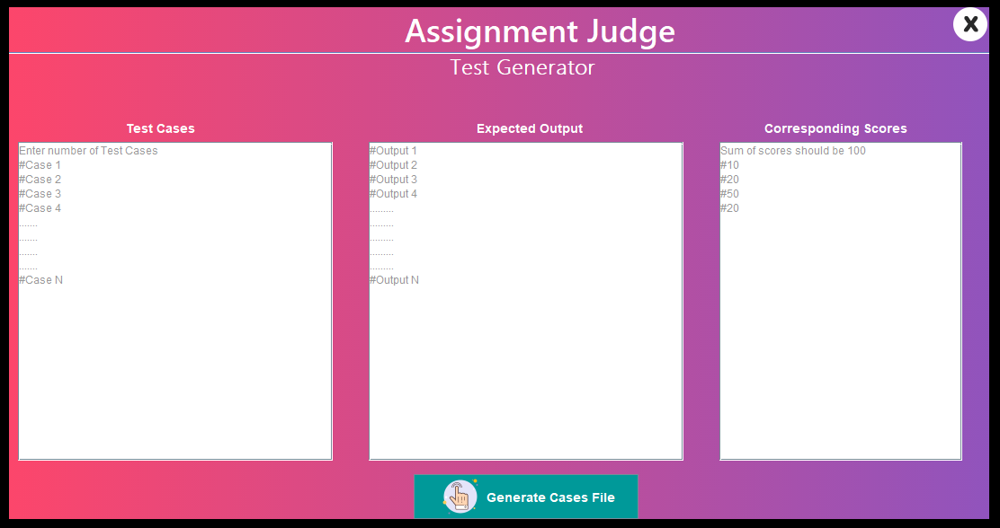

# Assignment-Judge
A Desktop application that simplifies the process of Grading Assignments. It automatically fetches the assignments from particular mail, judges them against a set of test cases and stores the result in SQL based database and generates cumulative excel reports on request.

---

## Tech Stack
- **Java** - Backend and frontend(Swing and AWT) of the application.
- **MySql** - Database for storing the scores and report generation
- **JavaMailAPI** - Fetching assignments from email over a given time period

---

## Screenshots

- Home Page

- Assignments Downloader

- Testcase Generator

